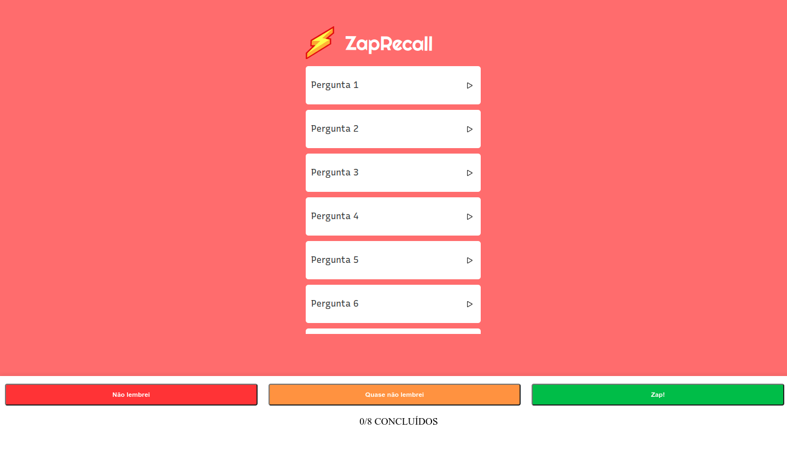
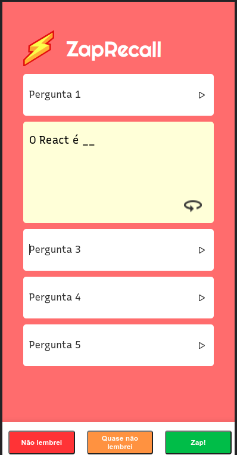

# ZapRecall
Este projeto tem como objetivo implementar um aplicativo de flashcards chamado "Zap Recall" utilizando React. Os flashcards são cartões que contêm perguntas/afirmações na frente e respostas no verso. Eles podem ser utilizados para treinar a memória com as metodologias "Active Recall" e "Spaced Repetition". A ideia é ler a pergunta ou afirmação e tentar lembrar da resposta. Ao se deparar com o mesmo flashcard novamente, é possível avaliar o quanto ele foi lembrado e decidir praticar mais ou não. Quando lembramos instantaneamente de um flashcard, dizemos que tivemos um "Zap!"

link da vercel https://projeto-09-zap-recall.vercel.app/





## Como rodar o projeto

1. Clone esse repositório 

2. Instalar as dependências 


```
npm install
```

Rode o projeto

```
npm start
```


